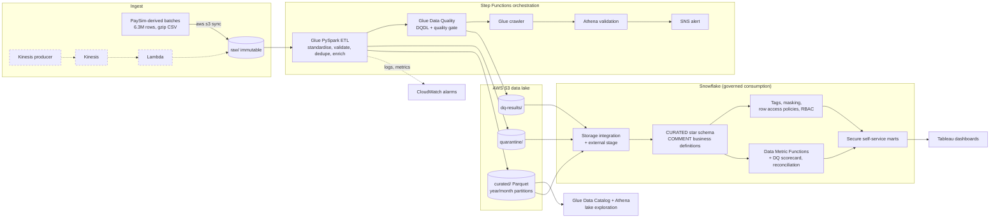

# Retail Banking Governed Analytics Platform — AWS + Snowflake


An orchestrated, governed data platform that processes **6.3M+ synthetic retail-banking transactions**:
**AWS Glue / PySpark** cleans and validates them in an S3 lake, **AWS Glue Data Quality** scores every run,
**Step Functions** orchestrates the pipeline, and **Snowflake** serves them as governed, self-service data
products — with classification tags, dynamic masking, row-level security, Data Metric Functions and
documented business definitions — visualised in **Tableau**.

> **Synthetic data.** Transactions are derived from the public PaySim simulation; customers, accounts and
> branches are generated. Nothing here represents a real bank or real customers.

## Business problem
Retail-bank decisions on deposits, payments and digital channels depend on transaction data that is
*trustworthy* and *appropriately accessible*. Duplicated postings, orphaned accounts or malformed amounts
silently distort KPIs, and over-broad access to customer identifiers is a governance risk. This project
treats both as first-class deliverables: every record is published or quarantined with a reason, every run
is scored and reconciled, and every consumer sees only what their role allows.

## Architecture


| Capability | Implementation |
|---|---|
| Large-scale ETL | Glue 4.0 PySpark over 13 gzip CSV batches (6.3M rows) → partitioned Parquet star schema |
| Orchestration | Step Functions: Glue job → crawler → Athena validation → SNS; failure catch path + CloudWatch alarm |
| Data quality (pipeline) | 11 row-level rules with reason codes → quarantine; 12-rule Glue DQ (DQDL) ruleset on raw & curated; quality gate at 5 % quarantine rate |
| Data quality (warehouse) | Snowflake Data Metric Functions (system + custom), referential-integrity and reconciliation views, unified DQ scorecard |
| Metadata & lineage | Glue Data Catalog; Snowflake column COMMENTs as business definitions; `source_file` + `run_id` row lineage; [glossary & lineage](docs/business_glossary.md) |
| Access governance | Snowflake RBAC (engineer / steward / analyst / regional analyst), classification tags, dynamic masking, row access policy |
| Self-service | Secure views in `ANALYTICS` schema; exports inherit the analyst's policies |
| BI | Tableau: executive, customer/channel and data-quality dashboards |
| Engineering practice | Local-Spark tests in GitHub Actions; scripted, idempotent deploy/teardown; least-privilege IAM |

## Data quality design
- **Ground truth:** `inject_dq_issues.py` injects known defects (~1.6 % + duplicates) and records them; CI asserts the
  pipeline quarantines exactly those rows.
- **Pipeline:** completeness, validity, timeliness, referential integrity and uniqueness checks; failing rows keep
  *all* reason codes. Glue DQ publishes rule outcomes to CloudWatch and the Glue console.
- **Gate:** if quarantine rate > 5 %, curated/ is not refreshed and an SNS alert fires.
- **Warehouse:** DMFs re-check duplicates, nulls, amounts, timestamps and channels on every Snowflake load;
  `dq.v_load_reconciliation` proves raw = curated + quarantined across S3 and Snowflake.

## Results
<!-- Fill in after your run -->
| Metric | Value |
|---|---|
| Raw rows processed | |
| Curated rows published / quarantined (rate) | |
| Glue DQ score — raw / curated | |
| Injected defects caught | / |
| Glue job duration (5 × G.1X) | |
| Tableau Public dashboard | [link]() |

**Insights:** 1. … 2. … 3. …

Screenshots in `dashboard/screenshots/`: Step Functions run, Glue DQ results, Snowflake masking by role,
DQ scorecard, Tableau dashboards.

## Run it
Step-by-step one-day guide: [`docs/runbook.md`](docs/runbook.md)

## Repository
```
data_generator/   PaySim mapping, synthetic dimensions, defect injection, sample generator
glue/             PySpark ETL job + DQDL ruleset
orchestration/    Step Functions state machine (ASL)
infra/            deploy / teardown scripts, Snowflake IAM handshake, least-privilege IAM policies
snowflake/        setup, load procedure, governance, data quality, marts + export
sql/              Athena marts + 21 business / channel / data-quality queries (lake exploration)
tableau/          dashboard spec, exported marts
streaming/        (stretch) Kinesis producer + Lambda consumer, deploy with infra/deploy_streaming.sh
docs/             runbook, data dictionary, business glossary & lineage
tests/            local-Spark tests run by GitHub Actions
```

## Cost control
Single region; Athena 10 GB scan cap; S3 lifecycle on scratch prefixes; Snowflake XS warehouse with
60 s auto-suspend and a resource monitor; `infra/teardown.sh` + `snowflake/99_teardown.sql` remove everything.

## What I would add in production
- Terraform for AWS + Snowflake, CI/CD deploys per environment
- Incremental loads (Glue bookmarks / Iceberg `MERGE`, Snowpipe auto-ingest) instead of full refresh
- dbt models + tests on the Snowflake side; tag-based masking at scale
- KMS encryption, Lake Formation permissions, SSO/SCIM-managed roles, periodic access reviews
- Freshness / quarantine-rate SLOs with alerting, and data contracts with upstream producers
